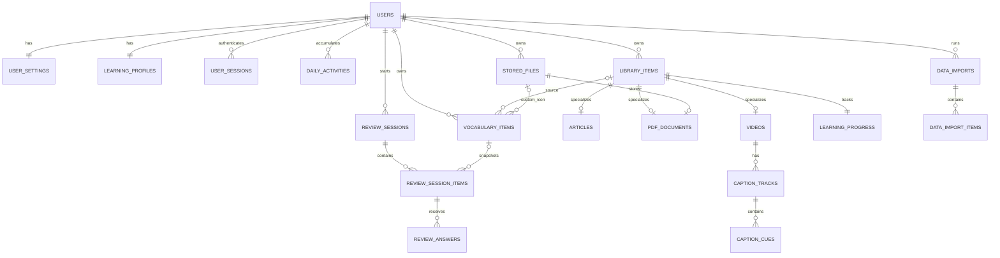

# Wordinary PostgreSQL Database Design

## 1. Scope and design goals

This design is derived from the current Wordinary schema contracts and the existing frontend data shapes.

Primary goals:

- PostgreSQL is the durable source of truth.
- Canonical identifiers are UUIDs.
- Canonical datetimes are timezone-aware (`timestamptz`).
- Learning progress remains `0..100` to match the current frontend.
- Legacy localStorage ids and epoch-millisecond timestamps are handled only by migration tables/services.
- API schemas and database tables are related but are not mirrored one-to-one.
- Article, PDF, and Video share a common Library parent but store type-specific data in separate tables.
- File bytes remain behind storage adapters; PostgreSQL stores file metadata and storage keys only.
- Dashboard fields are derived/aggregated; Dashboard has no table.
- Word analysis is stateless initially; an optional cache table may be added later.

## 2. Main decisions

### 2.1 PostgreSQL enums

For the first version, store domain enums as `varchar` plus `CHECK` constraints instead of native PostgreSQL enum types.

Reason:

- Easier Alembic changes when values evolve.
- Easier testing and schema rollback.
- SQLAlchemy can still expose Python `StrEnum` values.

### 2.2 UUIDs

Generate UUIDs in the application with `uuid.uuid4()`.

Legacy ids such as `library_article_*`, `library_pdf_*`, and starter article ids are never used as canonical primary keys. They are mapped through migration tables.

### 2.3 Datetimes

All canonical timestamps use PostgreSQL `timestamptz` and are stored in UTC.

Legacy `Date.now()` values are converted from epoch milliseconds during import.

### 2.4 Deletion policy

MVP uses hard deletes, not general soft deletes.

- Deleting a user cascades through owned data.
- Deleting a Library Item cascades to its detail/progress/captions.
- Vocabulary source links use `ON DELETE SET NULL` and keep source snapshots.
- Review history keeps immutable snapshots and remains valid if a Vocabulary Item is deleted.
- Physical file deletion is coordinated by the service/storage layer.

### 2.5 JSONB usage

Use JSONB only where the shape is intentionally variable or immutable:

- `learning_progress.position`
- provider-specific video metadata
- immutable review card snapshots
- migration warnings/raw legacy payloads

Do not put canonical title, type, progress, due date, mastery, caption timing, or ownership inside generic JSONB metadata.

## 3. ERD



Cross-table invariant:

- Every `library_items` row must have exactly one matching detail row according to `type`.
- Primary-key relationships enforce at most one Article/PDF/Video detail row.
- The Library service enforces the exact matching type during the transaction.

## 4. Core tables

## 4.1 `users`

Purpose: identity and login ownership root.

| Column | PostgreSQL type | Null | Notes |
|---|---|---:|---|
| `id` | `uuid` | no | Primary key |
| `email` | `varchar(320)` | no | Normalize before persistence |
| `password_hash` | `varchar(255)` | no | Argon2 hash, never returned by API |
| `display_name` | `varchar(80)` | no | |
| `status` | `varchar(20)` | no | `active`, `pending`, `disabled` |
| `email_verified_at` | `timestamptz` | yes | Future email verification |
| `created_at` | `timestamptz` | no | Default `now()` |
| `updated_at` | `timestamptz` | no | Maintained by service/model layer |

Constraints and indexes:

- Primary key: `id`
- Unique functional index: `lower(email)`
- Check: `status IN ('active', 'pending', 'disabled')`

## 4.2 `user_settings`

Purpose: UI/reader settings; one row per user.

| Column | Type | Null | Notes |
|---|---|---:|---|
| `user_id` | `uuid` | no | PK, FK → `users.id`, cascade |
| `language` | `varchar(12)` | no | Default `vi` |
| `theme` | `varchar(16)` | no | `light`, `dark`, `system` |
| `font_size` | `smallint` | no | Default `21`, range `12..32` |
| `reader_rail_collapsed` | `boolean` | no | Default `false` |
| `main_sidebar_collapsed` | `boolean` | no | Default `false` |
| `created_at` | `timestamptz` | no | |
| `updated_at` | `timestamptz` | no | |

Constraints:

- `font_size BETWEEN 12 AND 32`
- `theme IN ('light', 'dark', 'system')`

## 4.3 `learning_profiles`

Purpose: learning configuration and cached totals.

| Column | Type | Null | Notes |
|---|---|---:|---|
| `user_id` | `uuid` | no | PK, FK → users, cascade |
| `native_language` | `varchar(12)` | no | Default `vi` |
| `target_language` | `varchar(12)` | no | Default `en` |
| `xp` | `bigint` | no | Cached total, default `0` |
| `current_streak` | `integer` | no | Cached, default `0` |
| `longest_streak` | `integer` | no | Cached, default `0` |
| `daily_goal` | `integer` | no | Default `8`, range `1..200` |
| `timezone` | `varchar(60)` | no | IANA timezone, e.g. `Asia/Ho_Chi_Minh` |
| `last_activity_date` | `date` | yes | In user timezone |
| `created_at` | `timestamptz` | no | |
| `updated_at` | `timestamptz` | no | |

Notes:

- `daily_activity_count` is derived from today's `daily_activities.activity_count` row.
- XP/streak fields are backend-owned and updated transactionally.
- `daily_goal BETWEEN 1 AND 200`.
- Language fields are validated by Pydantic/service code; the database keeps them as short strings.

## 4.4 `daily_activities`

Purpose: one aggregate row per user/local calendar day; supports streak and dashboard queries.

| Column | Type | Null | Notes |
|---|---|---:|---|
| `id` | `uuid` | no | PK |
| `user_id` | `uuid` | no | FK → users, cascade |
| `activity_date` | `date` | no | User-local date |
| `activity_count` | `integer` | no | Default `0` |
| `xp_earned` | `integer` | no | Default `0` |
| `review_answers_count` | `integer` | no | Default `0` |
| `saved_vocabulary_count` | `integer` | no | Default `0` |
| `completed_items_count` | `integer` | no | Default `0` |
| `reading_seconds` | `integer` | no | Default `0` |
| `video_seconds` | `integer` | no | Default `0` |
| `created_at` | `timestamptz` | no | |
| `updated_at` | `timestamptz` | no | |

Constraints/indexes:

- Unique: `(user_id, activity_date)`
- All count/time fields `>= 0`
- Index: `(user_id, activity_date DESC)`

## 4.5 `user_sessions`

Purpose: refresh-token/session persistence. Access tokens do not require rows.

| Column | Type | Null | Notes |
|---|---|---:|---|
| `id` | `uuid` | no | PK |
| `user_id` | `uuid` | no | FK → users, cascade |
| `refresh_token_hash` | `varchar(255)` | no | Never store raw refresh token |
| `user_agent` | `varchar(512)` | yes | |
| `ip_address` | `inet` | yes | |
| `expires_at` | `timestamptz` | no | |
| `last_used_at` | `timestamptz` | yes | |
| `revoked_at` | `timestamptz` | yes | |
| `created_at` | `timestamptz` | no | |

Indexes:

- `(user_id, expires_at)`
- Partial index for active sessions: `revoked_at IS NULL`

## 4.6 `stored_files`

Purpose: metadata for bytes stored through local/S3/R2/MinIO adapters.

| Column | Type | Null | Notes |
|---|---|---:|---|
| `id` | `uuid` | no | PK |
| `user_id` | `uuid` | no | FK → users, cascade |
| `purpose` | `varchar(32)` | no | `pdf_document`, `vocabulary_icon` initially |
| `storage_backend` | `varchar(16)` | no | `local`, `s3`, `r2`, `minio` |
| `storage_key` | `text` | no | Internal key, never a public URL |
| `original_file_name` | `varchar(255)` | no | |
| `mime_type` | `varchar(127)` | no | |
| `size_bytes` | `bigint` | no | `>= 0` |
| `checksum_sha256` | `char(64)` | yes | Lowercase hex |
| `created_at` | `timestamptz` | no | |
| `deleted_at` | `timestamptz` | yes | Storage cleanup lifecycle only |

Constraints/indexes:

- Unique: `(storage_backend, storage_key)`
- Index: `(user_id, created_at DESC)`
- Check: `size_bytes >= 0`

Physical deletion is done by a service. A cleanup job may remove rows/files marked by `deleted_at`.

## 4.7 `library_items`

Purpose: common Library identity and list-card fields.

| Column | Type | Null | Notes |
|---|---|---:|---|
| `id` | `uuid` | no | PK |
| `user_id` | `uuid` | no | FK → users, cascade |
| `type` | `varchar(16)` | no | `article`, `pdf`, `video` |
| `title` | `varchar(300)` | no | |
| `description` | `varchar(1000)` | yes | |
| `source_url` | `text` | yes | Original URL when applicable |
| `thumbnail_url` | `text` | yes | |
| `processing_status` | `varchar(16)` | no | Default `ready` |
| `processing_error` | `text` | yes | Internal/user-safe message decision belongs to service |
| `created_at` | `timestamptz` | no | |
| `updated_at` | `timestamptz` | no | |

Constraints/indexes:

- `type IN ('article', 'pdf', 'video')`
- `processing_status IN ('pending', 'processing', 'ready', 'failed')`
- Index: `(user_id, type, created_at DESC)`
- Index: `(user_id, updated_at DESC)`

Not stored here:

- Article content
- PDF file bytes
- Video caption cues
- Progress/position
- Generic metadata JSONB

## 4.8 `articles`

Purpose: Article-specific content; one-to-one with Library Item.

| Column | Type | Null | Notes |
|---|---|---:|---|
| `library_item_id` | `uuid` | no | PK, FK → library_items, cascade |
| `content` | `text` | no | Sanitized canonical content |
| `content_format` | `varchar(16)` | no | `html`, `plain_text`, `markdown`; default product choice |
| `author` | `varchar(160)` | yes | |
| `level` | `varchar(30)` | yes | |
| `import_method` | `varchar(20)` | no | `paste`, `url`, `file` for Articles |
| `original_file_name` | `varchar(255)` | yes | For file imports |
| `mime_type` | `varchar(127)` | yes | |
| `word_count` | `integer` | no | Cached derived field |
| `reading_minutes` | `integer` | no | Cached derived field |
| `content_checksum` | `char(64)` | yes | Optional duplicate/change detection |

Constraints:

- `word_count >= 0`
- `reading_minutes >= 0`
- `import_method IN ('paste', 'url', 'file')`
- `content_format IN ('html', 'plain_text', 'markdown')`

`word_count` and `reading_minutes` are persisted caches because they are shown frequently in Library summaries.

## 4.9 `pdf_documents`

Purpose: PDF-specific data; one-to-one with Library Item.

| Column | Type | Null | Notes |
|---|---|---:|---|
| `library_item_id` | `uuid` | no | PK, FK → library_items, cascade |
| `file_id` | `uuid` | no | Unique FK → stored_files, restrict |
| `page_count` | `integer` | no | `>= 1` after processing |
| `text_layer_available` | `boolean` | no | Default `false` |
| `ocr_used` | `boolean` | no | Default `false` |

Notes:

- Public PDF metadata is composed from `pdf_documents`, `stored_files`, and runtime storage checks.
- File name, size, MIME type, checksum, and internal `storage_key` come from `stored_files`.
- `availableInSession` is never stored.
- `storage_key` is never returned by public API schemas.
- `download_url` and `download_url_expires_at` are generated from `storage_key` at response time.

## 4.10 `videos`

Purpose: Video-specific metadata; one-to-one with Library Item.

| Column | Type | Null | Notes |
|---|---|---:|---|
| `library_item_id` | `uuid` | no | PK, FK → library_items, cascade |
| `provider` | `varchar(20)` | no | `youtube`, `external`, `upload` |
| `provider_video_id` | `varchar(128)` | yes | YouTube id or provider id |
| `channel_name` | `varchar(255)` | yes | |
| `duration_seconds` | `double precision` | yes | `>= 0` |
| `embeddable` | `boolean` | yes | |
| `availability` | `varchar(64)` | yes | Provider status snapshot |
| `provider_metadata` | `jsonb` | no | Default `{}`, provider-only extras |

Constraints/indexes:

- `provider IN ('youtube', 'external', 'upload')`
- `duration_seconds IS NULL OR duration_seconds >= 0`
- Index: `(provider, provider_video_id)`

Caption count/language/source are obtained from Caption Tracks, not stored here.

## 4.11 `learning_progress`

Purpose: one progress record per owned Library Item.

| Column | Type | Null | Notes |
|---|---|---:|---|
| `library_item_id` | `uuid` | no | PK, FK → library_items, cascade |
| `progress_percent` | `numeric(5,2)` | no | Default `0`, range `0..100` |
| `position` | `jsonb` | no | Default `{}`; validated by service against item type |
| `started_at` | `timestamptz` | yes | First meaningful open |
| `last_opened_at` | `timestamptz` | yes | |
| `completed_at` | `timestamptz` | yes | |
| `updated_at` | `timestamptz` | no | |
| `version` | `integer` | no | Default `1`, optimistic concurrency |

Constraints/indexes:

- `progress_percent BETWEEN 0 AND 100`
- `version >= 1`
- Index: `(last_opened_at DESC)`

Canonical position examples:

```json
{"scrollProgress": 42.5, "paragraphIndex": 8, "characterOffset": 120}
```

```json
{"page": 12, "zoom": 1.15, "scrollOffset": 320}
```

```json
{"timestamp": 522.4, "captionIndex": 41}
```

## 4.12 `vocabulary_items`

Purpose: saved words/cards and review state.

| Column | Type | Null | Notes |
|---|---|---:|---|
| `id` | `uuid` | no | PK |
| `user_id` | `uuid` | no | FK → users, cascade |
| `source_library_item_id` | `uuid` | yes | FK → library_items, `SET NULL` |
| `source_type` | `varchar(16)` | no | `article`, `pdf`, `video`, `manual` |
| `word` | `varchar(200)` | no | Original surface form |
| `normalized_word` | `varchar(200)` | no | Lowercase/normalized for search |
| `lemma` | `varchar(200)` | yes | |
| `translation` | `varchar(500)` | no | |
| `definition` | `text` | yes | |
| `phonetic` | `varchar(200)` | yes | |
| `part_of_speech` | `varchar(80)` | yes | |
| `example_sentence` | `text` | yes | |
| `sentence_translation` | `text` | yes | |
| `icon_name` | `varchar(255)` | yes | Iconify-like canonical id |
| `icon_file_id` | `uuid` | yes | FK → stored_files, `SET NULL` |
| `icon_url` | `text` | yes | External canonical URL when allowed |
| `source_title_snapshot` | `varchar(300)` | yes | Survives source deletion |
| `source_url_snapshot` | `text` | yes | Survives source deletion |
| `source_context` | `text` | yes | Selected sentence/paragraph |
| `article_paragraph_index` | `integer` | yes | `>= 0` |
| `article_character_start` | `integer` | yes | `>= 0` |
| `article_character_end` | `integer` | yes | `>= start` |
| `pdf_page` | `integer` | yes | `>= 1` |
| `video_timestamp_seconds` | `double precision` | yes | `>= 0` |
| `video_caption_index` | `integer` | yes | `>= 0` |
| `mastery` | `smallint` | no | Default `0`, range `0..5` |
| `review_count` | `integer` | no | Default `0` |
| `last_result` | `varchar(10)` | yes | `good`, `again` |
| `last_reviewed_at` | `timestamptz` | yes | |
| `next_review_at` | `timestamptz` | yes | |
| `created_at` | `timestamptz` | no | |
| `updated_at` | `timestamptz` | no | |

Constraints:

- `source_type IN ('article', 'pdf', 'video', 'manual')`
- `mastery BETWEEN 0 AND 5`
- `review_count >= 0`
- `last_result IS NULL OR last_result IN ('good', 'again')`
- Character/page/time fields are nonnegative as applicable.
- `article_character_end >= article_character_start` when both exist.
- At most one of `icon_name`, `icon_file_id`, `icon_url` should be populated; enforce through a check or service validation.

Indexes:

- `(user_id, normalized_word)`
- `(user_id, next_review_at)` where `next_review_at IS NOT NULL`
- `(user_id, source_type)`
- `(source_library_item_id)`

No unique constraint on `(user_id, normalized_word)`: the same word may be saved with different senses or contexts.

## 4.13 `review_sessions`

Purpose: top-level review run.

| Column | Type | Null | Notes |
|---|---|---:|---|
| `id` | `uuid` | no | PK |
| `user_id` | `uuid` | no | FK → users, cascade |
| `mode` | `varchar(16)` | no | `all`, `due`, `retry`, `custom` |
| `status` | `varchar(16)` | no | `active`, `completed`, `abandoned` |
| `started_at` | `timestamptz` | no | |
| `completed_at` | `timestamptz` | yes | |

Indexes:

- `(user_id, started_at DESC)`
- Partial index for active sessions: `status = 'active'`

Counts and XP summary are derived from items/answers, not stored as primary truth.

## 4.14 `review_session_items`

Purpose: immutable deck snapshot for a session.

| Column | Type | Null | Notes |
|---|---|---:|---|
| `id` | `uuid` | no | PK |
| `session_id` | `uuid` | no | FK → review_sessions, cascade |
| `vocabulary_item_id` | `uuid` | yes | FK → vocabulary_items, `SET NULL` |
| `queue_index` | `integer` | no | Initial order, `>= 0` |
| `card_snapshot` | `jsonb` | no | Immutable UI payload used in this session |
| `mastery_at_start` | `smallint` | no | `0..5` |

Constraints/indexes:

- Unique: `(session_id, queue_index)`
- Unique: `(session_id, vocabulary_item_id)` when vocabulary id is not null
- `mastery_at_start BETWEEN 0 AND 5`

Snapshot may contain word, translation, sentence, phonetic, and resolved icon URL/reference. It prevents historical sessions from changing when a card is edited or deleted.

## 4.15 `review_answers`

Purpose: immutable answer history and idempotent grading.

| Column | Type | Null | Notes |
|---|---|---:|---|
| `id` | `uuid` | no | PK |
| `session_item_id` | `uuid` | no | FK → review_session_items, cascade |
| `client_answer_id` | `uuid` | no | Idempotency key from client |
| `result` | `varchar(10)` | no | `good`, `again` |
| `round_number` | `integer` | no | Server-owned, starts at `1` |
| `response_time_ms` | `integer` | yes | `0..3_600_000` |
| `mastery_before` | `smallint` | no | `0..5` |
| `mastery_after` | `smallint` | no | `0..5` |
| `xp_earned` | `integer` | no | Default `0` |
| `answered_at` | `timestamptz` | no | |

Constraints/indexes:

- Unique: `client_answer_id`
- Unique: `(session_item_id, round_number)`
- Index: `(session_item_id, answered_at)`
- Checks for result, round, mastery, response time, and nonnegative XP

The answer transaction updates:

1. `review_answers`
2. `vocabulary_items` review state
3. `daily_activities`
4. `learning_profiles` cached XP/streak fields

## 4.16 `caption_tracks`

Purpose: canonical track metadata for one Video.

| Column | Type | Null | Notes |
|---|---|---:|---|
| `id` | `uuid` | no | PK |
| `video_library_item_id` | `uuid` | no | FK -> videos.library_item_id, cascade |
| `language` | `varchar(12)` | no | Source language |
| `source` | `varchar(16)` | no | `manual`, `automatic`, `upload`, `pasted` |
| `processing_status` | `varchar(16)` | no | Default `ready` for synchronous imports |
| `processing_error` | `text` | yes | |
| `cue_count` | `integer` | no | Cached count, maintained by service |
| `is_default` | `boolean` | no | Default `false` |
| `provider_metadata` | `jsonb` | no | Default `{}` |
| `fetched_at` | `timestamptz` | no | |
| `updated_at` | `timestamptz` | no | |

Constraints/indexes:

- Unique: `(video_library_item_id, language, source)`
- `cue_count >= 0`
- Index: `(video_library_item_id, is_default)`
- Optional later index for background workers: `(updated_at)` where `processing_status IN ('pending', 'processing')`

`cue_count` is a denormalized cache because Library/Video summaries request it frequently. It is never accepted as client-owned truth.

## 4.17 `caption_cues`

Purpose: searchable/editable individual caption cues.

| Column | Type | Null | Notes |
|---|---|---:|---|
| `id` | `bigint generated always as identity` | no | PK; efficient for high row count |
| `track_id` | `uuid` | no | FK → caption_tracks, cascade |
| `cue_index` | `integer` | no | Stable order within track |
| `start_seconds` | `double precision` | no | `>= 0` |
| `end_seconds` | `double precision` | no | `> start_seconds` |
| `text` | `text` | no | |
| `translation` | `text` | yes | MVP single target translation |
| `created_at` | `timestamptz` | no | |
| `updated_at` | `timestamptz` | no | |

Constraints/indexes:

- Unique: `(track_id, cue_index)`
- Check: `start_seconds >= 0`
- Check: `end_seconds > start_seconds`
- Index: `(track_id, start_seconds)`

If multiple translation languages become necessary, replace `translation` with a separate `caption_cue_translations` table.

## 4.18 `data_imports`

Purpose: one localStorage migration run.

| Column | Type | Null | Notes |
|---|---|---:|---|
| `id` | `uuid` | no | PK |
| `user_id` | `uuid` | no | FK → users, cascade |
| `client_import_id` | `uuid` | no | Request `import_id` |
| `data_version` | `integer` | no | Legacy version |
| `dry_run` | `boolean` | no | Default `false` |
| `status` | `varchar(16)` | no | `pending`, `processing`, `completed`, `failed` |
| `imported_library_items` | `integer` | no | Default `0` |
| `imported_vocabulary_items` | `integer` | no | Default `0` |
| `skipped_items` | `integer` | no | Default `0` |
| `failed_items` | `integer` | no | Default `0` |
| `warnings` | `jsonb` | no | Default `[]` |
| `created_at` | `timestamptz` | no | |
| `completed_at` | `timestamptz` | yes | |

Constraints/indexes:

- Unique: `(user_id, client_import_id)`
- All counts `>= 0`
- Index: `(user_id, created_at DESC)`

## 4.19 `data_import_items`

Purpose: per-legacy-record result and persistent id mapping.

| Column | Type | Null | Notes |
|---|---|---:|---|
| `id` | `uuid` | no | PK |
| `import_id` | `uuid` | no | FK → data_imports, cascade |
| `user_id` | `uuid` | no | FK → users, cascade; denormalized for unique mapping |
| `entity_type` | `varchar(32)` | no | `library_item`, `vocabulary_item`, `caption_track`, `user_settings`, `learning_profile` |
| `local_id` | `text` | no | Legacy prefixed/string id |
| `canonical_id` | `uuid` | yes | Polymorphic target id; intentionally no FK |
| `status` | `varchar(16)` | no | `imported`, `skipped`, `failed` |
| `warning` | `text` | yes | |
| `payload_hash` | `char(64)` | yes | Detect changed retry payload |
| `raw_payload` | `jsonb` | yes | Optional temporary audit/debug payload |
| `created_at` | `timestamptz` | no | |

Constraints/indexes:

- Unique: `(user_id, entity_type, local_id)`
- Index: `(import_id, status)`
- Index: `(user_id, canonical_id)`
- Check: `entity_type IN ('library_item', 'vocabulary_item', 'caption_track', 'user_settings', 'learning_profile')`

`id_map` in the migration response is derived from these rows.

## 5. Derived, cached, and runtime-only fields

| API/UI field | Database source | Classification |
|---|---|---|
| `saved_word_count` | Count vocabulary rows by source item | Derived |
| `caption_count` | `caption_tracks.cue_count` or count cues | Cached/derived |
| `file_size_bytes` | `stored_files.size_bytes` | Persisted |
| `checksum_sha256` | `stored_files.checksum_sha256` | Persisted |
| `download_url` | Generated from `stored_files.storage_key` | Runtime-derived |
| `download_url_expires_at` | Generated with `download_url` | Runtime-derived |
| `file_available` | Storage adapter/file row state | Runtime-derived |
| `availableInSession` | Browser memory only | Never persisted |
| `daily_activity_count` | Today's `daily_activities.activity_count` | Derived |
| Dashboard counts | Aggregate queries | Derived |
| Review known/missed count | Aggregate `review_answers` | Derived |
| Review XP total | Sum `review_answers.xp_earned` | Derived |
| Article reading minutes | Cached in `articles` | Cached |
| Vocabulary `source` object | Composed from source columns/snapshots | Response-composed |
| Vocabulary custom data URL | Migrated to `stored_files` | Migration-only input |

## 6. Recommended PostgreSQL indexes

Initial indexes beyond PK/FK indexes:

```sql
CREATE UNIQUE INDEX uq_users_email_ci
ON users (lower(email));

CREATE INDEX ix_library_items_user_type_created
ON library_items (user_id, type, created_at DESC);

CREATE INDEX ix_learning_progress_recent
ON learning_progress (last_opened_at DESC)
WHERE last_opened_at IS NOT NULL;

CREATE INDEX ix_vocabulary_user_due
ON vocabulary_items (user_id, next_review_at)
WHERE next_review_at IS NOT NULL;

CREATE INDEX ix_vocabulary_user_word
ON vocabulary_items (user_id, normalized_word);

CREATE INDEX ix_review_sessions_user_started
ON review_sessions (user_id, started_at DESC);

CREATE INDEX ix_caption_cues_track_time
ON caption_cues (track_id, start_seconds);

CREATE INDEX ix_daily_activities_user_date
ON daily_activities (user_id, activity_date DESC);
```

Optional later:

- `pg_trgm` indexes for Library title and vocabulary search.
- PostgreSQL full-text index for Article content.
- Partial indexes for active processing jobs/sessions.

Do not add search extensions until the actual query patterns require them.

## 7. Transaction boundaries

### Create Article

One transaction:

1. Insert `library_items(type='article')`.
2. Insert `articles`.
3. Insert default `learning_progress`.

### Upload PDF

Database transaction:

1. Save bytes through storage adapter.
2. Insert `stored_files`.
3. Insert `library_items(type='pdf', processing_status=...)`.
4. Insert `pdf_documents`.
5. Insert default `learning_progress`.

If DB commit fails, storage service removes the newly stored object. If physical cleanup fails, an orphan-cleanup job handles it.

### Add Video

One transaction:

1. Insert `library_items(type='video')`.
2. Insert `videos`.
3. Insert default `learning_progress`.
4. Caption track processing may be synchronous or scheduled later.

### Save Vocabulary

One transaction:

1. Validate source ownership if source id exists.
2. Normalize/upload data URL icon if necessary.
3. Insert `vocabulary_items`.
4. Update today's `daily_activities` and cached profile XP if the product awards XP.

### Answer Review

One transaction:

1. Reject duplicate `client_answer_id` by returning the existing answer.
2. Lock/update Vocabulary Item review state.
3. Insert `review_answers`.
4. Update `daily_activities`.
5. Update `learning_profiles` caches.

## 8. SQLAlchemy model locations

```text
app/modules/users/models.py
- User
- UserSettings
- LearningProfile
- DailyActivity

app/modules/auth/models.py
- UserSession

app/storage/models.py
- StoredFile

app/modules/library/models.py
- LibraryItem
- Article
- PDFDocument
- Video

app/modules/progress/models.py
- LearningProgress

app/modules/vocabulary/models.py
- VocabularyItem

app/modules/review/models.py
- ReviewSession
- ReviewSessionItem
- ReviewAnswer

app/modules/captions/models.py
- CaptionTrack
- CaptionCue

app/modules/migration/models.py
- DataImport
- DataImportItem
```

`app/storage/models.py` stores file metadata for the storage boundary. It does
not need a public router or Pydantic API schema initially.

`app/db/models.py` imports every ORM model so Alembic sees one complete metadata graph.

No initial database models are needed for:

- Dashboard
- Word Analysis
- API error schemas
- Pagination/query schemas

## 9. Recommended implementation order

1. DB base mixins, naming convention, async session.
2. Users, Settings, Learning Profile, Daily Activity.
3. Auth Session.
4. Stored File metadata.
5. Library parent and Article/PDF/Video detail tables.
6. Learning Progress.
7. Vocabulary.
8. Review Session/Item/Answer.
9. Caption Track/Cue.
10. Migration audit/mapping tables.
11. First Alembic revision containing the complete initial schema.
12. Repositories/selectors/services only after model and migration tests pass.

## 10. Tables intentionally deferred

### `word_analysis_cache`

Add only when provider cost/latency makes caching necessary. Suggested key:

- source language
- target language
- normalized text
- sentence hash
- provider/model version

### `processing_jobs`

Add when PDF OCR/caption extraction becomes asynchronous and requires retry, scheduling, or a worker queue.

### `learning_events`

Add if Wordinary needs a full immutable XP/audit ledger. For MVP, transactional updates to `daily_activities`, review answers, and profiles are sufficient.

### Workspace/sharing tables

Not included in MVP. If sharing is introduced later, progress ownership must become `(user_id, library_item_id)` rather than one progress row per owned item.

## 11. Final table set

Core/application tables:

```text
users
user_settings
learning_profiles
daily_activities
user_sessions
stored_files
library_items
articles
pdf_documents
videos
learning_progress
vocabulary_items
review_sessions
review_session_items
review_answers
caption_tracks
caption_cues
```

Migration support tables:

```text
data_imports
data_import_items
```

Total initial tables: **19**.
